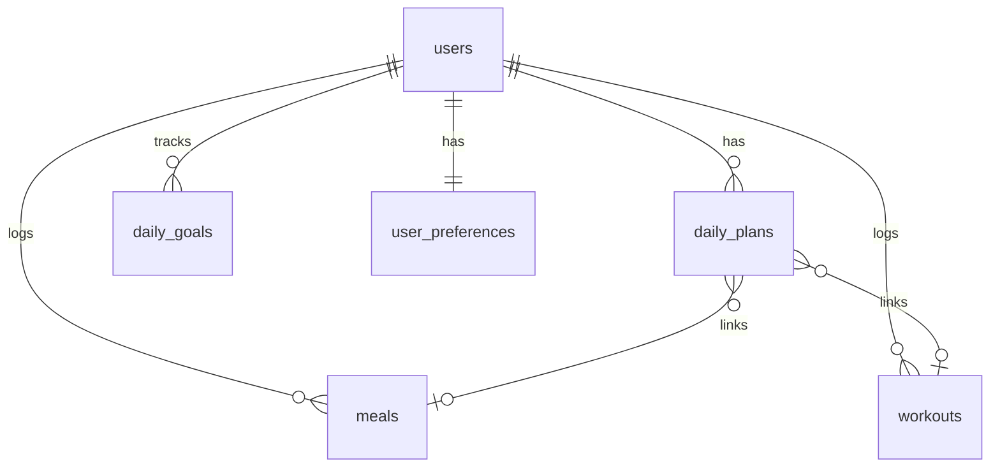

# 🗄️ PD-Fit — MongoDB Schema Reference

> Complete database schema for all features in the NutriFit AI Tracker application.  
> Database: **pd_fit_db**

---

## Collections Overview

| Collection | Purpose |
|---|---|
| `users` | User accounts, profile info, body metrics, preferences |
| `meals` | Logged meals with macros and optional images |
| `workouts` | Logged workout sessions |
| `daily_plans` | Scheduled daily plans (meals + workouts) |
| `daily_goals` | Per-user daily nutrition & activity targets |
| `user_preferences` | App settings (theme, notifications, etc.) |

---

## 1. `users`

```js
{
  _id: ObjectId,
  name: String,                    // "Alex Johnson"
  email: {
    type: String,
    unique: true,
    lowercase: true,
    required: true
  },
  passwordHash: String,            // bcrypt hash
  avatar: String,                  // URL to profile image (S3/Cloudinary)

  // Body Metrics
  height: Number,                  // cm
  weight: Number,                  // kg — current
  goalWeight: Number,              // kg — target
  weightHistory: [{
    value: Number,                 // kg
    date: Date
  }],

  // Goals
  dailyCalorieGoal: {
    type: Number,
    default: 2200
  },

  // Account
  joinDate: {
    type: Date,
    default: Date.now
  },
  lastLoginAt: Date,
  isActive: {
    type: Boolean,
    default: true
  },

  // Timestamps
  createdAt: Date,
  updatedAt: Date
}

// Indexes
{ email: 1 }                       // unique
```

---

## 2. `meals`

```js
{
  _id: ObjectId,
  userId: {
    type: ObjectId,
    ref: 'users',
    required: true,
    index: true
  },

  // Core
  name: {
    type: String,
    required: true,
    trim: true
  },
  calories: {                      // kcal
    type: Number,
    required: true,
    min: 0
  },

  // Macronutrients (grams)
  protein: { type: Number, default: 0, min: 0 },
  carbs:   { type: Number, default: 0, min: 0 },
  fats:    { type: Number, default: 0, min: 0 },

  // Image (from expo-image-picker)
  imageUri: String,                // local URI or uploaded URL

  // Timing
  mealTime: {
    type: String,                  // "08:00 AM"
    required: true
  },
  mealType: {
    type: String,
    enum: ['breakfast', 'lunch', 'dinner', 'snack'],
    default: 'snack'
  },
  date: {
    type: Date,                    // date of the meal
    required: true,
    index: true
  },

  // Timestamps
  createdAt: Date,
  updatedAt: Date
}

// Compound index for history screen (sorted by date)
{ userId: 1, date: -1 }
```

---

## 3. `workouts`

```js
{
  _id: ObjectId,
  userId: {
    type: ObjectId,
    ref: 'users',
    required: true,
    index: true
  },

  // Core
  title: {
    type: String,
    required: true,
    trim: true
  },
  type: {
    type: String,
    enum: ['cardio', 'strength', 'flexibility', 'other'],
    required: true
  },
  duration: {                      // minutes
    type: Number,
    required: true,
    min: 1
  },
  caloriesBurned: {
    type: Number,
    default: 0,
    min: 0
  },

  // Details
  notes: String,                   // optional free-text notes

  // Exercises (for strength-type workouts)
  exercises: [{
    name: String,                  // "Bench Press"
    sets: Number,
    reps: Number,
    weight: Number,                // kg
    restSeconds: Number
  }],

  // Timing
  date: {
    type: Date,
    required: true,
    index: true
  },
  startTime: String,               // "07:00 AM"
  endTime: String,                 // "07:45 AM"

  // Timestamps
  createdAt: Date,
  updatedAt: Date
}

// Compound index for history screen
{ userId: 1, date: -1 }
// Index for analytics aggregation
{ userId: 1, type: 1, date: -1 }
```

---

## 4. `daily_plans`

```js
{
  _id: ObjectId,
  userId: {
    type: ObjectId,
    ref: 'users',
    required: true
  },

  date: {
    type: Date,
    required: true
  },

  // Planned items
  items: [{
    title: String,                 // "Morning Cycling"
    subtitle: String,              // "45 mins • Cardio"
    icon: String,                  // "bicycle-outline" (Ionicons name)
    color: String,                 // hex color code
    type: {
      type: String,
      enum: ['meal', 'workout']
    },
    linkedMealId: ObjectId,        // ref: 'meals' (if completed)
    linkedWorkoutId: ObjectId,     // ref: 'workouts' (if completed)
    isCompleted: {
      type: Boolean,
      default: false
    },
    scheduledTime: String          // "07:00 AM"
  }],

  // Timestamps
  createdAt: Date,
  updatedAt: Date
}

// Compound unique index
{ userId: 1, date: 1 }
```

---

## 5. `daily_goals`

```js
{
  _id: ObjectId,
  userId: {
    type: ObjectId,
    ref: 'users',
    required: true
  },

  date: {
    type: Date,
    required: true
  },

  // Nutrition goals
  calories: {
    target: { type: Number, default: 2200 },
    consumed: { type: Number, default: 0 }
  },
  protein: {
    target: { type: Number, default: 160 },      // grams
    consumed: { type: Number, default: 0 }
  },
  water: {
    target: { type: Number, default: 8 },         // glasses
    consumed: { type: Number, default: 0 }
  },

  // Activity goals
  activeMinutes: {
    target: { type: Number, default: 60 },
    achieved: { type: Number, default: 0 }
  },
  workoutCount: {
    target: { type: Number, default: 1 },
    achieved: { type: Number, default: 0 }
  },

  // Streak tracking
  isStreakDay: {
    type: Boolean,
    default: false
  },

  // Timestamps
  createdAt: Date,
  updatedAt: Date
}

// Compound unique index
{ userId: 1, date: 1 }
// Index for streak calculation
{ userId: 1, isStreakDay: 1, date: -1 }
```

---

## 6. `user_preferences`

```js
{
  _id: ObjectId,
  userId: {
    type: ObjectId,
    ref: 'users',
    unique: true,
    required: true
  },

  // Theme (maps to ThemeProvider)
  theme: {
    type: String,
    enum: ['light', 'dark', 'system'],
    default: 'system'
  },

  // Notifications
  notifications: {
    enabled: { type: Boolean, default: true },
    mealReminders: { type: Boolean, default: true },
    workoutReminders: { type: Boolean, default: true },
    reminderTimes: {
      breakfast: String,           // "08:00"
      lunch: String,               // "13:00"
      dinner: String,              // "19:00"
      workout: String              // "07:00"
    }
  },

  // Units
  units: {
    weight: {
      type: String,
      enum: ['kg', 'lbs'],
      default: 'kg'
    },
    height: {
      type: String,
      enum: ['cm', 'ft'],
      default: 'cm'
    }
  },

  // Timestamps
  createdAt: Date,
  updatedAt: Date
}

// Index
{ userId: 1 }                     // unique
```

---

## 🔗 Relationships Diagram



---

## 📊 Common Aggregation Queries

### Weekly Activity (Analytics Screen)
```js
db.workouts.aggregate([
  { $match: { userId: ObjectId("..."), date: { $gte: weekStart } } },
  { $group: {
    _id: { $dayOfWeek: "$date" },
    totalMinutes: { $sum: "$duration" },
    totalCalories: { $sum: "$caloriesBurned" }
  }},
  { $sort: { "_id": 1 } }
])
```

### Daily Calorie Summary (Dashboard)
```js
db.meals.aggregate([
  { $match: { userId: ObjectId("..."), date: today } },
  { $group: {
    _id: null,
    totalCalories: { $sum: "$calories" },
    totalProtein: { $sum: "$protein" },
    totalCarbs: { $sum: "$carbs" },
    totalFats: { $sum: "$fats" },
    mealCount: { $sum: 1 }
  }}
])
```

### Active Streak (Profile/Analytics)
```js
db.daily_goals.find({
  userId: ObjectId("..."),
  isStreakDay: true
}).sort({ date: -1 })
// Count consecutive days from today backwards
```

### Workout History Grouped by Date
```js
db.workouts.aggregate([
  { $match: { userId: ObjectId("...") } },
  { $sort: { date: -1 } },
  { $group: {
    _id: {
      $dateToString: { format: "%Y-%m-%d", date: "$date" }
    },
    workouts: { $push: "$$ROOT" }
  }},
  { $sort: { "_id": -1 } }
])
```

---

## 🛡️ Validation Rules Summary

| Field | Rule |
|---|---|
| `users.email` | Unique, lowercase, valid email format |
| `meals.calories` | `min: 0`, required |
| `meals.protein/carbs/fats` | `min: 0`, defaults to `0` |
| `workouts.duration` | `min: 1`, required |
| `workouts.type` | Enum: `cardio`, `strength`, `flexibility`, `other` |
| `user_preferences.theme` | Enum: `light`, `dark`, `system` |
| `user_preferences.units.weight` | Enum: `kg`, `lbs` |
| `daily_goals` compound key | One entry per `userId + date` |

---

> **Note:** All collections use Mongoose `timestamps: true` to auto-generate `createdAt` and `updatedAt` fields. All `ObjectId` references should use `mongoose.Schema.Types.ObjectId` with appropriate `ref` values for `.populate()` support.
